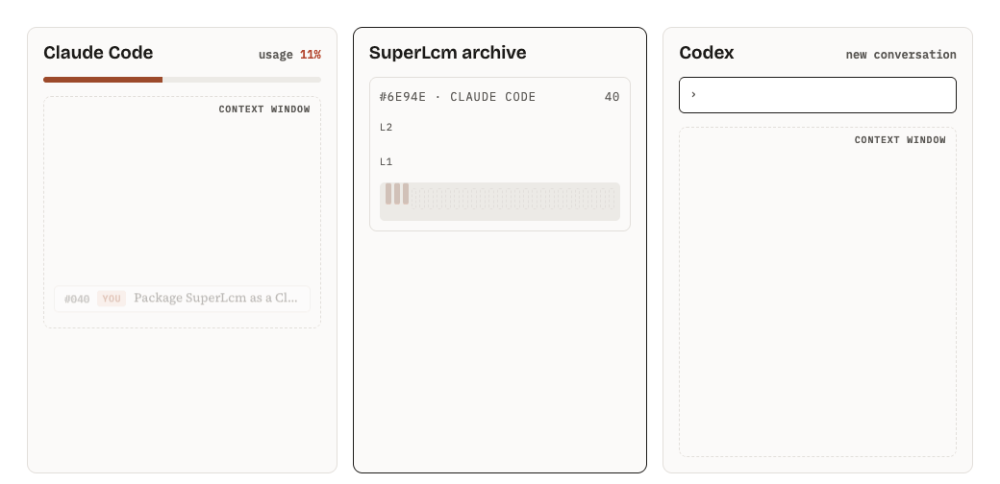
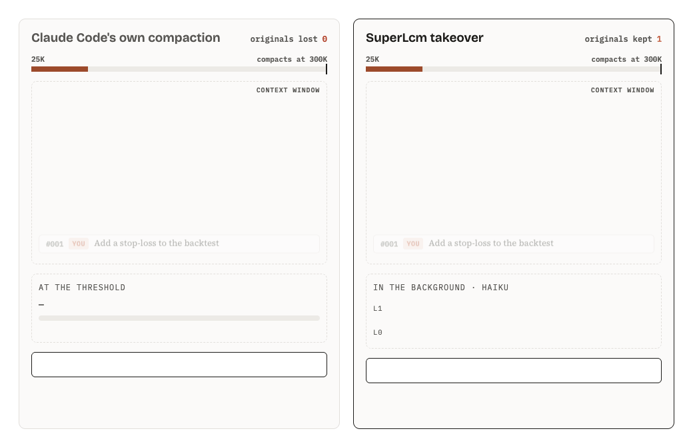
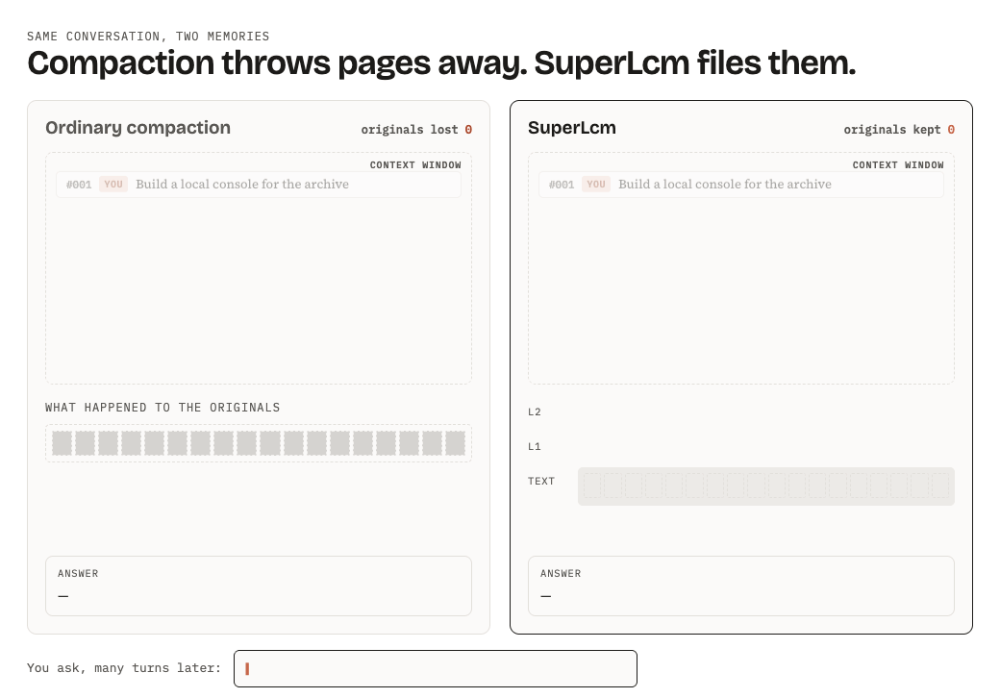
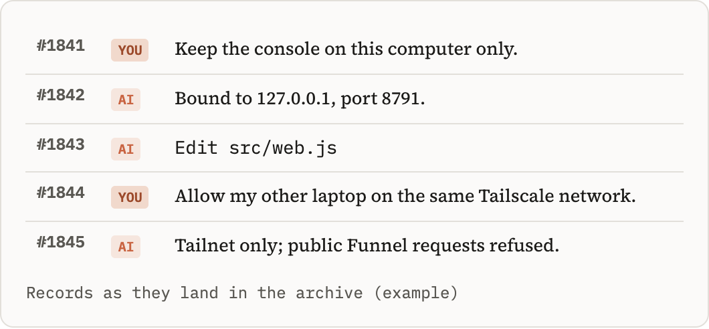
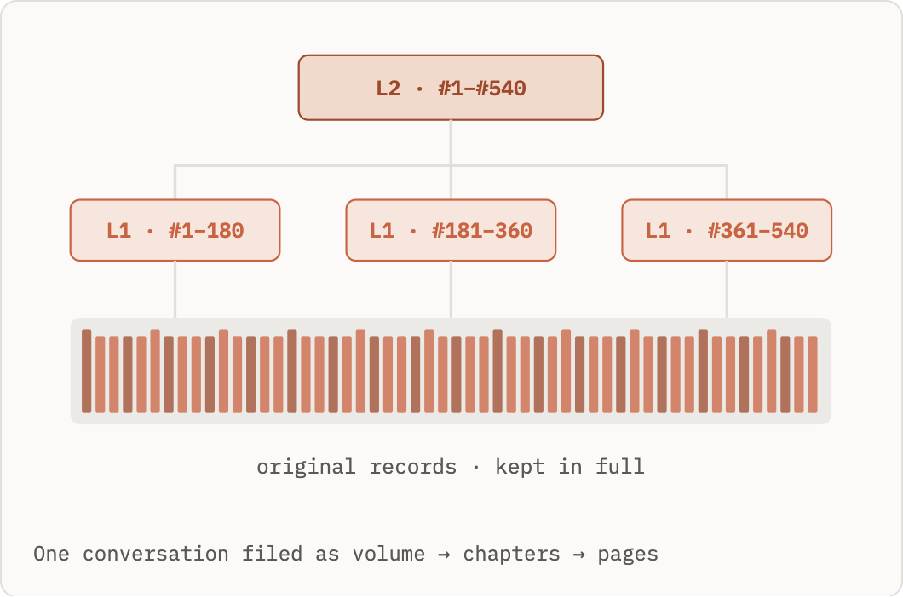
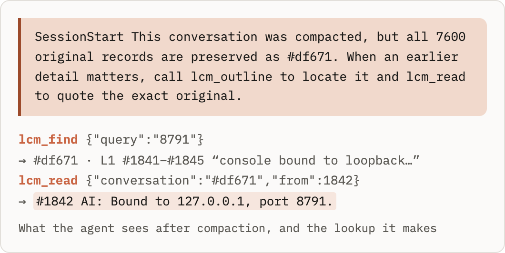

<h1 align="center">SuperLcm</h1>

<b>Five harnesses. One local conversation archive.</b> Keep every original. Recall any detail. Continue in another harness.

<b>English</b> · <a href="README.zh-CN.md">中文</a>

SuperLcm gives **Claude Code, Codex, Hermes, Pi and dsh harness** a shared conversation archive on your own computer. Original records stay available word for word; layered summaries help you find what matters. Switch tools and continue the same task with one short handoff, then read any earlier detail directly from its source.

From 0.5.11, background writers and Claude/DSH compaction share rules for chronology, decisions and rationale, authorization scope, failed tools and source recall. Existing summaries are retained, not automatically regenerated. See [summary semantics and validation limits](docs/SUMMARY-SEMANTICS-0.5.11.md).

## Five harnesses, one archive

| Harness | Archive, summaries and continuation | Compaction integration | How to connect |
|---|---|---|---|
| Claude Code | Supported | SuperLcm takeover, enabled explicitly | Claude plugin or console |
| Codex | Supported | Native host compaction | Console: MCP tools and capture hooks |
| Hermes | Supported | Native host compaction | Console: Hermes configuration and capture hooks |
| Pi | Supported | Native host compaction | Console: auto-discovered extension |
| dsh harness | Supported | Native host compaction, shared archive and background summaries | Console: connect globally and choose a summary API |

All five connections default to archiving, background summaries and recall, with compaction owned by the host. Claude Code takeover remains an explicit optional setting; installing or updating its connection turns it off. The default DSH component never mounts a compaction engine.

Start with the [installation package](docs/RELEASE.md), run `superlcm web`, and choose your tool under **Connect**. Claude Code users can also [install the Claude plugin](#install-as-a-claude-plugin) and open `/superlcm:console`. For dsh harness, choose its configured provider and model, connect once globally, then reload dsh harness; see [dsh harness setup](docs/DSH.md).

## Move a whole conversation, summaries and all, into another tool

<picture><source media="(prefers-color-scheme: dark)" srcset="docs/images/handoff-en-dark.gif"></picture>

- **Pick up exactly where you stopped.** Out of quota, rate-limited, or want a second model's opinion: say `Continue #6e94e via SuperLcm` in the other tool and the task continues.
- **No retelling, no giant paste.** `lcm_continue` hands over the layered outline and the latest messages, so the new agent starts with a small, focused context instead of the whole transcript.
- **Every detail still one call away.** The whole conversation stays in the archive. When an early decision matters, the new agent reads that record word for word with `lcm_read`.
- **Any direction, back and forth.** Claude Code, Codex, Hermes, Pi and dsh harness all read and write the same archive, and the continued work is archived too, so the task can be handed back the same way.

## For Claude Code: compaction you never wait for

<picture><source media="(prefers-color-scheme: dark)" srcset="docs/images/takeover-en-dark.gif"></picture>

Claude Code's own compaction stops the conversation at the threshold, asks the model to squeeze everything into one summary, and drops the originals. Installed as a Claude plugin, SuperLcm turns that around:

- **Assembled in the background, ahead of time.** After each turn the plugin writes the waiting summary pieces while you keep working, so by the time the context fills up the replacement is already there.
- **No stall at the threshold.** At the threshold (300K tokens by default; 200K, 500K, 800K or a custom size up to 950K) SuperLcm swaps the older part for the fewest layered summaries that cover it, in one step and with no model call. It takes milliseconds, not a minute of "Compacting…".
- **The work in hand keeps its detail.** The newest 40K tokens (adjustable: 20K, 40K, 80K or a custom size) stay word for word. Only older parts become summaries, so the agent carries on as if nothing happened.
- **Lossless.** Only the agent's view gets shorter. Every original stays in the archive, numbered, and the agent quotes it back with `lcm_read` when a detail matters.
- **Summaries by Haiku, inside the conversation.** With "Own tool, in the background" and model `haiku` on the Claude Code card, the plugin calls Haiku through the conversation's own login. No API key, no second Claude Code session, and the expensive main model is not spent on bookkeeping.
- **Safe by default.** Off until you turn it on. If the summaries have not caught up or anything looks wrong, Claude Code compacts the usual way, and turning it off restores your previous setting. Subagents always compact the usual way.

What a swap looks like on a real conversation of about 12,000 records: the older part became 3 summaries of about 8,000 characters (a few thousand tokens), the newest stretch stayed verbatim, and a 300K context came back at roughly 70K, most of it Claude Code's own system prompt and tool definitions.

**What the Claude plugin brings**

| Part | What it does |
|---|---|
| Capture hooks | Save every turn to the archive as it happens |
| Lookup tools | `lcm_find`, `lcm_outline`, `lcm_read`, `lcm_continue` for the agent |
| Plugin module | Compaction takeover and in-conversation summaries (Claude Code 2.1.286+) |
| `/superlcm:console` | Opens the local console: settings, conversations, connecting other tools |

The module runs in the terminal `claude` and in the Claude desktop app's Code tab from Claude Code 2.1.286. Older versions still get capture and lookup; the takeover starts working when they update. Settings › Compaction in the console shows what this computer supports.

## Compaction throws pages away. SuperLcm files them.

<picture><source media="(prefers-color-scheme: dark)" srcset="docs/images/compare-en-dark.gif"></picture>

Both sides start with the same 18 messages and a context window that holds six. Ordinary compaction squeezes everything into one shorter summary each time, and the originals are gone. SuperLcm saves each group of messages in full, writes a summary card that points back to them, and binds the cards into a higher level. Asked many turns later which port the console uses, the agent follows the path down with `lcm_find`, `lcm_outline` and `lcm_read` and quotes the original.

## How it works

**Every turn is saved as it happens.** Your messages, the agent's replies and its tool calls are archived from each harness's transcript or native event stream. Original files or complete event records are retained and indexed for source-checked reads. Each record gets a number, so it can be cited later like a page in a ledger. The archive stays on your computer; summary generation uses the writer you select.

<picture><source media="(prefers-color-scheme: dark)" srcset="docs/images/fig1-en-dark.png"></picture>

**Summaries in layers, each one pointing at its pages.** A run of messages (about 12,000 characters, adjustable) becomes a short summary; neighbouring summaries can be merged into higher layers. The top reads like a table of contents for the whole conversation, and every entry carries the record numbers it came from. A summary is a signpost, never a replacement.

<picture><source media="(prefers-color-scheme: dark)" srcset="docs/images/fig2-en-dark.png"></picture>

**The agent reads the original before it answers.** After a compaction the agent is told where the full record lives, and its lookup tools search summaries and original text (Chinese and English), open the outline, and read exact records checked against the source transcript.

<picture><source media="(prefers-color-scheme: dark)" srcset="docs/images/fig3-en-dark.png"></picture>

## Who writes the summaries

**dsh harness owns compaction; SuperLcm writes independent background summaries.** Select a saved API on its connection card or under Plugins → SuperLcm in DSH. Summaries enter the archive without replacing the active context. Migration and disconnect verify native compaction and preserve configured chat models.

Import existing DSH sessions under Connect → dsh harness → Import past conversations. Complete tool records are retained, no model is called, and repeated imports are deduplicated.

Chosen per tool in the console: **the agent itself** (optional), **the tool's own CLI** (the default) in a short background run with the account and model you already use (for Claude Code 2.1.286+ with the plugin, the model is called from inside the conversation instead; Haiku is a good choice), **your own API** (any Anthropic or OpenAI-compatible endpoint, including a gateway on your own computer), or **off** (everything is still saved and searchable).

## Compaction vs. an archive

| | Ordinary compaction | SuperLcm |
|---|---|---|
| The original words | Out of the agent's reach after compaction | Kept in full, readable by record number |
| Summary shape | One flat summary, shorter each time | Layers like a book, each pointing at its pages |
| A detail from 300 turns ago | Survives only if the summary kept it | Found by search, quoted exactly |
| When the context fills up (Claude Code) | Stop and wait while a model summarizes | Summaries ready in advance, swapped in at once |
| Continuing in another tool | Start over and re-explain | One sentence, with outline and recent messages |
| Where it lives | — | A file on your computer |

## Install as a Claude plugin

In Claude Code:

    /plugin marketplace add yu381792/superlcm
    /plugin install superlcm@superlcm

The plugin brings everything listed above for Claude Code; to use the compaction takeover, open the console and turn it on under Settings › Compaction. `/superlcm:console` opens the console, where Codex, Hermes, Pi and dsh harness are connected to the same archive. It runs wherever Claude can start local programs (Claude Code, and Cowork on your own computer), not in claude.ai web or mobile chat. Needs Node.js 22.16 or newer on PATH; an older `node` hands over to a newer one if one is installed.

Plugin updates replace the plugin folder, so tools connected from the plugin's console are pointed at a fixed entry file in the SuperLcm folder (`~/.superlcm-claude/superlcm.js`) that follows updates. If Claude Code was connected from the console before, the older hooks in Claude's settings stay quiet once the plugin is enabled, and the console's Claude card offers to remove them and the older `superlcm` MCP entry (backed up first). The same card installs and updates the plugin.

## Quick start (from a checkout)

    node src/cli.js web

Open `http://127.0.0.1:8791/` (no login; it only listens on this computer), then:

1. **接入 (Connect)** — pick Claude Code, Codex, Hermes, Pi or dsh harness and confirm. SuperLcm registers its MCP server and capture hooks (for Pi, one extension file), backs up the config first, and verifies it loads. For dsh harness, choose its configured provider and model; the integration is global. Reload dsh harness after installation. Codex and Hermes want new hooks approved once; a checkbox in the dialog (on by default) does that for you through each tool's own mechanism, so no terminal step is needed.
2. **对话 (Conversations)** — browse, search and read every stored conversation and its summary tree. Click **换个工具继续** to get the one-line handoff for another tool.
3. **设置 (Settings)** — choose who writes summaries: the AI inside the conversation (optional), a separate background run of the conversation's own tool (Claude Code, Codex, Hermes or Pi, with whatever account and model you set up there, pickable per tool), or a custom API that SuperLcm calls directly (any Anthropic or OpenAI-compatible endpoint). Tune segment size and merge width, and turn on the Claude Code compaction takeover under Compaction.

Terminal equivalents: `superlcm setup dsh --provider <provider> --model <model> --apply`, `node src/cli.js setup codex --apply`, `node src/cli.js setup claude-code --apply`, `node src/cli.js summarize <conversation> --backend cli`.

Hermes keeps its transcripts in a SQLite database and rewrites them on compression, so SuperLcm keeps its own append-only copy of every message row and joins a compression chain into one conversation. Pi session files are append-only and are indexed byte for byte, all branches included.

## MCP tools

| Tool | Purpose |
|---|---|
| `lcm_continue` | Hand over another conversation: top-level outline + recent messages + how to dig deeper |
| `lcm_find` | Find conversations by `#code`, name or ID, and search summaries and originals |
| `lcm_outline` | Expand the summary tree one level at a time |
| `lcm_read` | Read exact original records by number |
| `lcm_summary_task` / `lcm_summary_submit` | In-conversation summary mode only: claim a segment, submit its summary (verified against the originals) |

Every tool is marked with MCP annotations: the four lookups are read-only, the two summary tools write only SuperLcm's own summaries, and none is destructive or reaches outside this computer, so hosts such as Codex run them without asking each time.

## More

- [Setup, security and limitations](docs/SETUP.md)
- [Console behavior and tests](docs/CONSOLE.md)
- [Privacy](PRIVACY.md)
- [Changelog](CHANGELOG.md) · [Contributing](CONTRIBUTING.md) · [Contributions](CLA.md) · [Security](SECURITY.md)
- License: [MIT](LICENSE). Copyright 2026 ygc381792 and contributors. Free to use, modify and redistribute, including commercially; keep the copyright notice.

Claude, Claude Code, Codex, Hermes and Pi names and logos belong to their respective owners and are used only to identify compatible tools. SuperLcm is an independent project and is not affiliated with or endorsed by them.

Segments default to about 48,000 characters, with four children per condensed summary. Manage connection → Disconnect stops automatic capture and summaries, removes recall registration and keeps all stored originals and summaries. Reload existing sessions afterwards. Import and startup history replay never start model calls.
