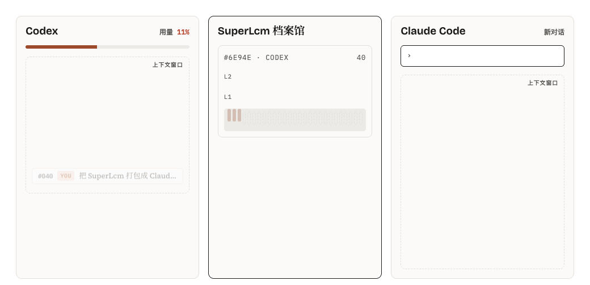
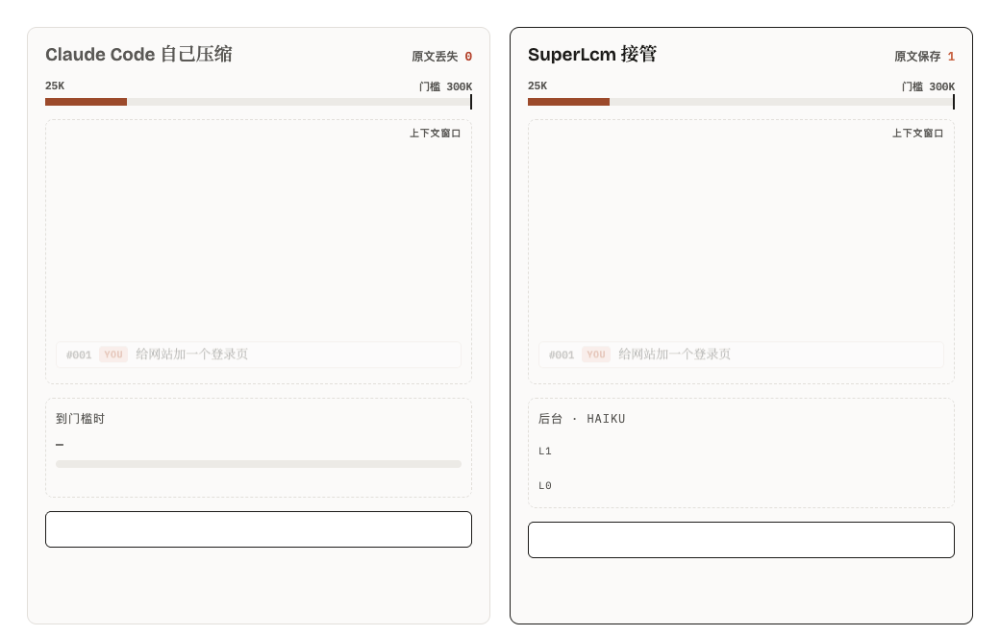
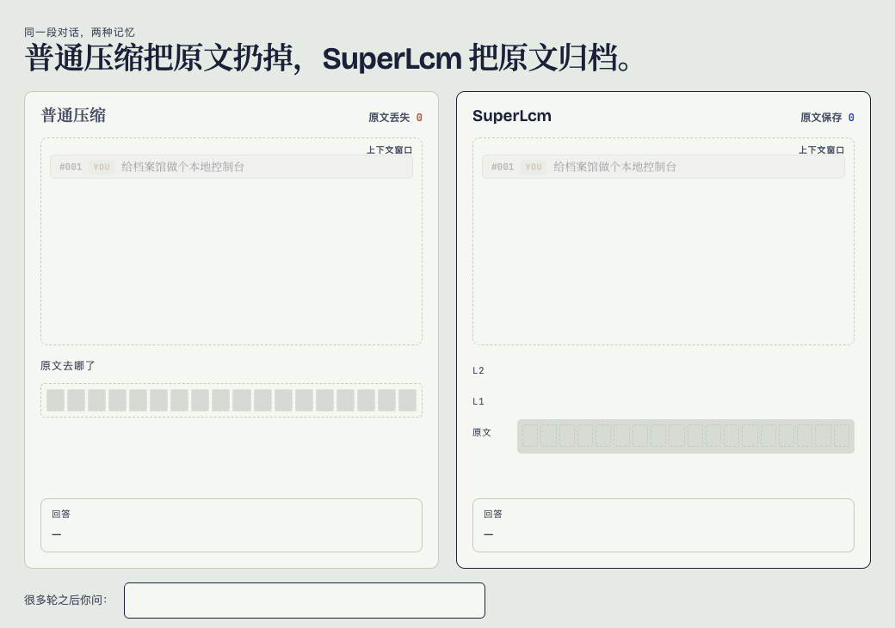
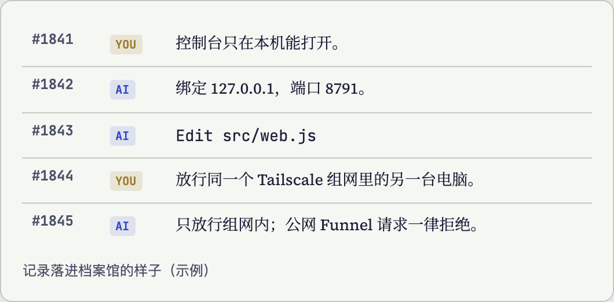
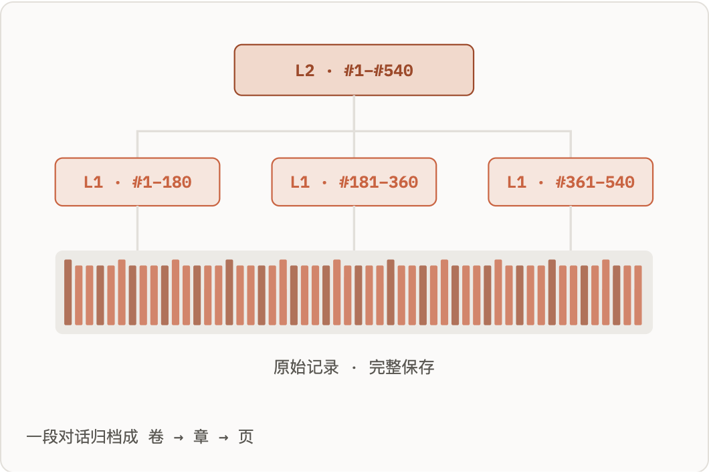
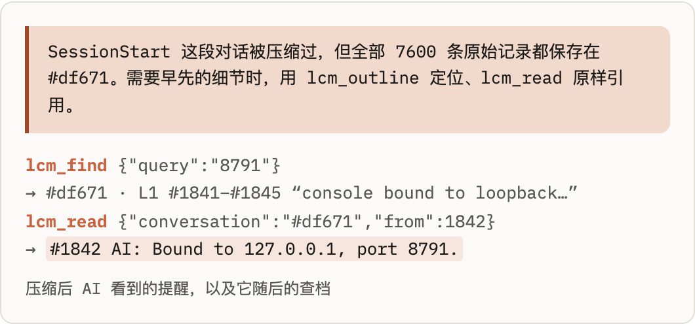

<h1 align="center">SuperLcm</h1>

<b>五种载体，一座本地对话档案馆。</b> 原文完整保存，摘要分层整理，换个载体继续任务。

<a href="README.md">English</a> · <b>中文</b>

SuperLcm 让 **Claude Code、Codex、Hermes、Pi 和 dsh harness** 共用一座存放在你电脑上的对话档案馆。原始记录完整保留，分层摘要帮助你快速找到要紧的部分。换个工具时，一句话就能接续任务；早先的细节随时按编号查原文。

## 五种载体，一座档案馆

| 载体 | 原文存档、分层摘要、跨载体接续 | 压缩接入 | 怎么接入 |
|---|---|---|---|
| Claude Code | 支持 | SuperLcm 接管，需明确开启 | Claude 插件或控制台 |
| Codex | 支持 | 暂未接管压缩 | 控制台：查档工具和记录钩子 |
| Hermes | 支持 | 暂未接管压缩 | 控制台：通过 Hermes 自身配置接入 |
| Pi | 支持 | 暂未接管压缩 | 控制台：自动加载的扩展 |
| dsh harness | 支持 | SuperLcm 插件接管压缩，原文和摘要共享归档 | 控制台：选择已有模型，全局接入一次 |

五种载体都能存档、整理摘要和接续任务。真正替换模型当前上下文的压缩接入，目前有两种：**Claude Code 和 dsh harness 均由 SuperLcm 接管压缩**。控制台会区分已保存的配置和实际运行状态。

先从 [安装包说明](docs/RELEASE.md) 安装，运行 `superlcm web`，在「接入」页选择工具即可。Claude Code 用户也可 [安装 Claude 插件](#安装成-claude-插件)，用 `/superlcm:console` 打开控制台。dsh harness 用户从现有供应商及模型列表中选择压缩模型，点击「安装并启用压缩」完成全局接入，再重新加载 dsh harness；见 [接入说明](docs/DSH.md)。

## 把整段对话连同摘要，整个搬进另一个工具

<picture><source media="(prefers-color-scheme: dark)" srcset="docs/images/handoff-zh-dark.gif"></picture>

- **停在哪，就从哪接着干。** 额度用完、被限速，或者想让另一个模型看看，到另一个工具里说一句 `通过 SuperLcm 接续对话 #6e94e`，任务就接着往下走。
- **不用复述，不用整段粘贴。** `lcm_continue` 交过去的是分层目录加最近几条原文，新的 AI 一开局上下文就小而准，不是把整份聊天记录硬塞进去。
- **每个细节随时一查就有。** 整段对话都在档案馆里。早先的某个决定要紧时，新的 AI 用 `lcm_read` 按编号把那条原文一字不差地读出来。
- **任意方向，来回都行。** Claude Code、Codex、Hermes、Pi、dsh harness 读写的是同一座档案馆，接着干的内容也会存进去，以后可以用同样的办法再交还回去。

## 给 Claude Code 用：压缩不用等

<picture><source media="(prefers-color-scheme: dark)" srcset="docs/images/takeover-zh-dark.gif"></picture>

Claude Code 自带的压缩，到门槛时会让对话停下来，叫模型把所有内容挤成一段摘要，原文随之丢掉。SuperLcm 装成 Claude 插件后，把这件事反过来做：

- **后台提前组装好。** 每聊完一轮，插件就在后台把攒够的摘要写好，你照常干活。等上下文快满时，替换内容早已备好。
- **到门槛不卡。** 到了门槛（默认 300K token，可选 200K、500K、800K 或自定义，最高 950K），SuperLcm 一步把旧的部分换成能盖住它的最少几张分层摘要，不调用任何模型。几毫秒完成，不用干等一分钟的「正在压缩」。
- **手头的活不丢细节。** 最近 40K token 一字不改地留下（可选 20K、40K、80K 或自定义），更早的才换成摘要，AI 接着干活基本无感。
- **无损。** 缩短的只是 AI 眼前的视图，每一条原文都按编号留在档案馆里，细节要紧时 AI 用 `lcm_read` 原样调回。
- **Haiku 在对话里写摘要。** 在 Claude Code 卡片上选「本工具后台写」、模型选 `haiku`，插件就用当前对话的登录直接调 Haiku。不要 API 密钥，不另开 Claude Code 会话，也不拿昂贵的主模型做记账。
- **默认稳妥。** 不打开就不生效。摘要没跟上或有任何不对劲，照旧交回 Claude Code 自己压缩；关掉开关就恢复你原来的设置。子代理始终按原样压缩。

拿一段约 12000 条记录的真实对话算：旧的部分换成 3 张摘要，约 8000 字（几千 token），最近一段原样保留，300K 的上下文降到七万左右，其中大头是 Claude Code 自己的系统提示和工具说明。

**Claude 插件里有什么**

| 部分 | 作用 |
|---|---|
| 记录钩子 | 每一轮说完就存进档案馆 |
| 查档工具 | `lcm_find`、`lcm_outline`、`lcm_read`、`lcm_continue`，给 AI 用 |
| 插件模块 | 接管压缩、在对话里写摘要（Claude Code 2.1.286+） |
| `/superlcm:console` | 打开本机控制台：设置、浏览对话、接入其他工具 |

插件模块从 Claude Code 2.1.286 起可用，终端里的 `claude` 和 Claude 桌面 App 的 Code 标签页都行。更早的版本照样能记录和查档，等它更新后接管压缩自动生效。控制台 设置 › 压缩 会显示这台电脑支持到哪一步。

## 普通压缩把原文扔掉，SuperLcm 把原文归档

<picture><source media="(prefers-color-scheme: dark)" srcset="docs/images/compare-zh-dark.gif"></picture>

两边是同样的 18 条消息，上下文窗口都只装得下 6 条。普通压缩每次都把所有内容挤成一段更短的摘要，原文就此没了。SuperLcm 把每一组消息完整存档，写一张摘要卡指回原文，卡片再装订成上一层。很多轮之后问“控制台端口定的是多少”，AI 用 `lcm_find` 找、`lcm_outline` 翻目录、`lcm_read` 读原文，一路查下去把原话引出来。

## 怎么做到的

**每一轮对话，说完就存。** 你的消息、AI 的回复和它调用的工具，从各载体自己的对话文件或原始事件中归档。原始文件或完整事件记录保留在本机，查阅时会核对来源。每条记录都有编号，以后能像账本页码一样被引用。档案留在你电脑上，生成摘要时使用你选择的模型。

<picture><source media="(prefers-color-scheme: dark)" srcset="docs/images/fig1-zh-dark.png"></picture>

**摘要分层，每一层都指回原文页码。** 一段消息（约 12,000 字，可调）写成一条短摘要，相邻摘要再合成更高一层。树顶读起来就像整段对话的目录，每一条都带着它来自哪些记录的编号。摘要只是路标，不是替代品。

<picture><source media="(prefers-color-scheme: dark)" srcset="docs/images/fig2-zh-dark.png"></picture>

**AI 先读原文，再回答。** 每次压缩之后，AI 会收到一句提醒，告诉它完整记录存在哪。它的查档工具能搜摘要和原文（中英文都行）、翻目录、按编号读原文，读出来的内容会和原始对话文件核对。

<picture><source media="(prefers-color-scheme: dark)" srcset="docs/images/fig3-zh-dark.png"></picture>

## 摘要谁来写

**dsh harness 由 SuperLcm 插件接管压缩。** 接入后在 DSH 的「插件 → SuperLcm」设置压缩模型、开关、门槛和原文保留；SuperLcm 后台的「设置 → 压缩」只保留 Claude Code。插件生成分层摘要、替换旧上下文，并将原文和摘要存入共享档案；不会同时启动第二套摘要写入器。下面的选择适用于 Claude Code、Codex、Hermes 和 Pi。

在控制台里按工具分别选：**对话里的 AI 自己写**（默认，它刚经历过这段，凭记忆就能写）、**本工具后台写**（单独起一次该工具的命令行，用你已经配好的账号和模型；插件配 Claude Code 2.1.286+ 时改为在对话内部直接调用模型，选 Haiku 就很合适）、**自定义 API**（任何兼容 Anthropic 或 OpenAI 的地址，包括你电脑上自己跑的网关），或者**关闭**（照样全部存下、能搜）。

## 压缩 vs 档案馆

| | 普通压缩 | SuperLcm |
|---|---|---|
| 原话 | 压缩后 AI 就够不着了 | 完整保存，按编号随时读 |
| 摘要形态 | 一段扁平摘要，每压一次更短 | 像书一样分层，每层指回页码 |
| 300 轮前的一个细节 | 摘要碰巧留下了才有 | 搜得到，原样引用 |
| 上下文满了（Claude Code） | 停下来等模型总结 | 摘要提前备好，到点直接换上 |
| 换个工具接着干 | 从头再讲一遍 | 一句话，带着目录和最近原文 |
| 存在哪 | — | 你电脑上的一个文件 |

## 安装成 Claude 插件

在 Claude Code 里：

    /plugin marketplace add yu381792/superlcm
    /plugin install superlcm@superlcm

插件自带上面列出的全部功能；要用接管压缩，打开控制台在 设置 › 压缩 里打开开关。`/superlcm:console` 打开控制台，在那里把 Codex、Hermes、Pi、dsh harness 接进同一座档案馆。能用的地方是 Claude 能启动本机程序的地方：Claude Code，以及在你自己电脑上运行的 Cowork；claude.ai 网页版和手机聊天用不了。需要 PATH 里有 Node.js 22.16 或更新版本；如果默认的 `node` 太旧，而电脑上装有更新的版本，会自动换用新的。

插件更新会替换插件文件夹，所以从插件控制台接入的其他工具会连到 SuperLcm 文件夹里一个固定的入口文件（`~/.superlcm-claude/superlcm.js`），它会跟着插件更新走。如果之前已经从控制台接入过 Claude Code，启用插件后设置里的旧钩子会自动静默；控制台的 Claude 卡片可以一键清掉旧钩子和旧的 `superlcm` MCP 条目（先备份）。安装和更新插件也在这张卡片上。

## 从源码运行

    node src/cli.js web

打开 `http://127.0.0.1:8791/`（不用登录，只在本机监听），在“接入”页选工具并确认即可。更多说明见英文文档：[安装、安全与限制](docs/SETUP.md) · [控制台说明](docs/CONSOLE.md)。

## 许可

[MIT](LICENSE)，版权所有 2026 ygc381792 及贡献者。可以自由使用、修改和再发布（包括商用），保留版权声明即可。本项目由个人维护、刻意保持精简：欢迎提 [issue](https://github.com/yu381792/superlcm/issues) 反馈问题和需求，但不保证每条都采纳，一般不合并代码请求（PR）。

Claude、Claude Code、Codex、Hermes、Pi 的名称和标志归各自所有者，这里只用来说明兼容的工具；SuperLcm 是独立项目，与它们没有隶属或背书关系。
